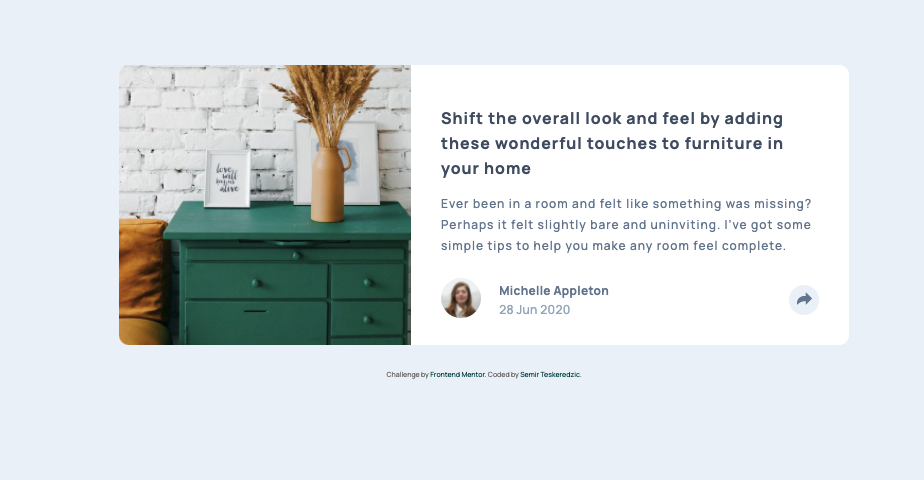

# Frontend Mentor - Article preview component solution

This is a solution to the [Article preview component challenge on Frontend Mentor](https://www.frontendmentor.io/challenges/article-preview-component-dYBN_pYFT). Frontend Mentor challenges help you improve your coding skills by building realistic projects. 

## Table of contents

- [Overview](#overview)
  - [The challenge](#the-challenge)
  - [Screenshot](#screenshot)
  - [Links](#links)
- [My process](#my-process)
  - [Built with](#built-with)
- [Author](#author)

## Overview

### The challenge

Users should be able to:

- View the optimal layout for the component depending on their device's screen size
- See the social media share links when they click the share icon

### Screenshot

### Links

- Solution URL: [Solution URL]()
- Live Site URL: [Live Site URL](https://semirteskeredzic.github.io/article-preview/)

## My process

Before starting to code I've created an empty git repository and initialized a git repository inside my project folder, then I set the git remote to the newly created repository.
After that I reviewed design and wrote down HTML structure of elements along with the class names using double and single dash notation. I've created a new preparation branch and went on implementing HTML structure along with global imports of fonts and stylesheets. I've pushed the code and merged it to main branch. 

I went from mobile view and populated all HTML elements and added icon elements. Then I styled mobile view and inserted AlpineJS in script tag. I've used Alpine to control conditional opening of the share container on top of the regular container.

On desktop view all elements were pretty much styled, I just needed to flex it in the row fashion and adjust some paddings. Share container was dislocated to the absolute element above the button. Alpine did its magic here so it is reactive to the clicks.

### Built with

- Semantic HTML5 markup
- CSS custom properties
- Flexbox
- AlpineJS
- Mobile-first workflow

## Author

- Github - [Semir Teskeredzic](https://github.com/semirteskeredzic)
- Frontend Mentor - [@semirteskeredzic](https://www.frontendmentor.io/profile/semirteskeredzic)
- Twitter - [@dofedome](https://www.twitter.com/dofedome)

